# Demo Project 1

Create AWS EKS cluster with a Node Group

## Technologies Used

Kubernetes, AWS EKS

## Project Description

- Configure necessary IAM Roles
- Create VPC with Cloudformation Template for Worker Nodes
- Create EKS cluster (Control Plane Nodes)
- Create Node Group for Worker Nodes and attach to EKS cluster
- Configure Auto-Scaling of worker nodes
- Deploy a sample application to EKS cluster

### Details of project

- Create EKS IAM Role and VPC 

  The first step in the project is to create an IAM role with specific policies for EKS.

  By creating a role named eks-cluster-role configured to operate on a Kubernetes cluster, AWS automatically attaches a specific policy called AmazonEKSClusterPolicy, which provides permissions for services such as EC2, Load Balancer, Auto Scaling, etc.

  Next, a VPC was created for the worker nodes, as the EKS cluster requires specific configurations like network rules and security groups to allow the control plane to communicate with the worker nodes.

  Setting up an appropriate VPC for EKS can be complex, so to simplify this process, AWS provides a VPC template in CloudFormation.

  In CloudFormation, a stack was created using a VPC template with both public and private subnets, hosted in a public AWS bucket. The template URL was found in the documentation: 
  
  ```
    https://s3.us-west-2.amazonaws.com/amazon-eks/cloudformation/2020-10-29/amazon-eks-vpc-private-subnets.yaml.
  ```
  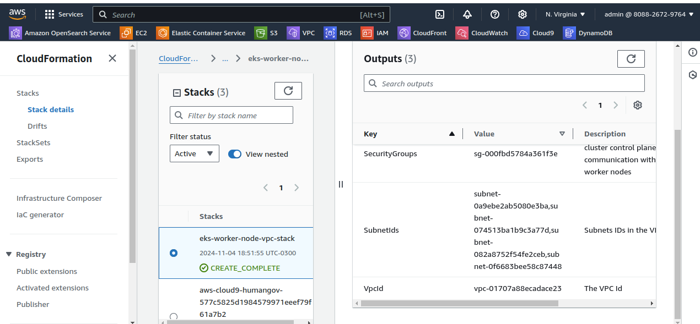

  When the VPC is created in CloudFormation, it provides the outputs shown in the figure above, which are necessary to create the Control Plane.

- Create EKS Cluster

  The cluster was created using the previously created role, version 1.27, the VPC and security group from CloudFormation, with both public and private access endpoints enabled. Logs were not configured, as AWS already monitors everything, and the default EKS add-ons were set.

  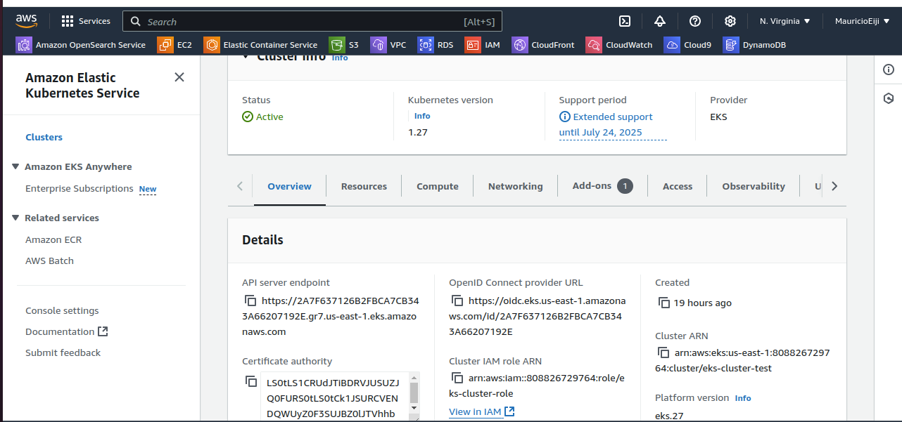

  Now that the cluster is created, it’s possible to connect to it using kubectl:

  ```
    aws eks update-kubeconfig --name eks-cluster-test
  ```

  This command creates a local kubeconfig. It is possible to verify the control plane using the following command:

  ```
    kubectl cluster-info
  ```
 
- Create Worker Nodes

  The first step in this stage is to create a node group to optimize resource creation. The worker node's kubelet is the main process that communicates with AWS services and needs permissions to perform tasks.

  The role to be created will use the EC2 service, as the worker nodes will run on these instances. Three policies will be configured within this role: AmazonEKSWorkerNodePolicy (which includes access to EC2 and EKS), AmazonEC2ContainerRegistryReadOnly (which includes access to ECR), and AmazonEKS_CNI_Policy (Container Network Interface for Kubernetes).

  Next, the node group was created within EKS under the Compute section. The role created in the previous step was assigned to it, and then the EC2 instance was configured. The default EC2 settings were used, except for changing the instance size to t3.small. The node group scaling is set to default, as auto-scaling will be configured in later steps. In networking, remote access to the nodes was configured using a pre-created key, and access from any IP was allowed.

  Once the node group began creation, the EC2 instances were provisioned and can be accessed via the aws console. After the worker nodes are created, they can be viewed in the terminal using:

  ```
    kubectl get nodes
  ```

  This command shows the IP addresses of the EC2 instances created in AWS.

  In this process, all necessary components for the worker node to function on the instances—such as the container runtime, kubelet, and k-proxy—were installed by the node group.

  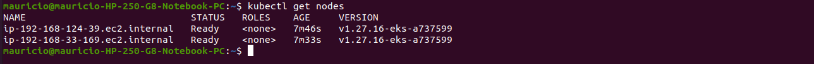

- Node Group Creation and Auto Scaling Configuration
  
  When the node group is created, an Auto Scaling group is automatically linked to the EC2 service.

  To enable automatic scaling of applications, a Kubernetes component running in the cluster should utilize the AWS Auto Scaling group.

  For the auto-scaler to work properly, the instances within the worker node need permissions to make API calls to AWS. A custom policy was created and assigned to the Node Group IAM Role:

  ```
    {
      "Version": "2012-10-17",
      "Statement": [
        {
          "Action": [
              "autoscaling:DescribeAutoScalingGroups",
              "autoscaling:DescribeAutoScalingInstances",
              "autoscaling:DescribeLaunchConfigurations",
              "autoscaling:DescribeTags",
              "autoscaling:SetDesiredCapacity",
              "autoscaling:TerminateInstanceInAutoScalingGroup",
              "ec2:DescribeLaunchTemplateVersions"
          ],
          "Resource": "*",
          "Effect": "Allow"
        }
      ]
    }
  ```
 
  To allow the auto-scaler in the cluster to communicate with AWS’s scaling group, two tags are applied to the worker node:

  - k8s.io/cluster-autoscaler/eks-cluster-test
  - k8s.io/cluster-autoscaler/enabled

  These tags were automatically configured when the worker node was created.

- Deploy Cluster Autoscaler
  
  The auto-scaler for this project is available at the following link:

  ```
    https://raw.githubusercontent.com/kubernetes/autoscaler/master/cluster-autoscaler/cloudprovider/aws/examples/cluster-autoscaler-autodiscover.yaml
  ```

  Run the following command to deploy it:

  ```
    kubectl apply -f <link>
  ```

  After deploying this component, some modifications should be made. Under annotations, add the following line:

  ```
    cluster-autoscaler.kubernetes.io/safe-to-evict: "false"
  ```

  In the container section, replace <YOUR CLUSTER NAME> with the name of the cluster created in AWS and add the following configurations:

  ```
    - --balance-similar-node-groups
    - --skip-nodes-with-system-pods=false
  ```

  Also, update the auto-scaler image version to match the cluster version.

  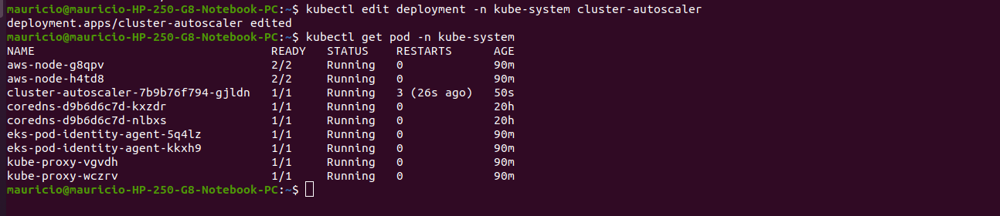

  After editing the cluster and checking the pod, you’ll notice that each node has a kube-proxy, which is the worker process that runs on each available worker node, the core-DNS with two replicas (regardless of the number of nodes), and the node process that runs on each worker node, in addition to the auto-scaler running in one instance.

- Deploy Nginx Application

  An application containing Nginx (nginx-config.yaml) will be deployed, utilizing an external load balancer provided by AWS. Access to the application will be through the load balancer's endpoint. Run the following command:

  ```
    kubectl apply -f nginx-config.yaml 
  ```

  This process will automatically create a load balancer, which can be viewed in the AWS console.

  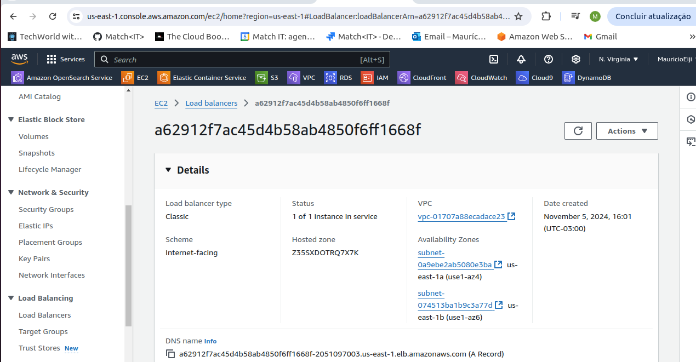

  By accessing the DNS of the load balancer, you can reach the application.

  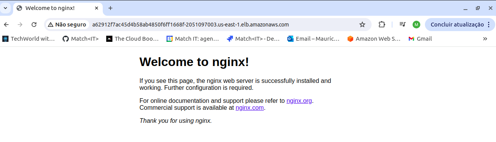

  The load balancer performs internal forwarding; it is accessed on port 80 by default, but within the application, it routes to the node’s port, which is above 30000. In this case, port 32168 is used, and it does not need to be included in the load balancer URL.

  Furthermore, load balancers are made available in the public subnets of the VPC, as these subnets enable internet traffic.

# Demo Project 2

Create EKS cluster with Fargate profile

## Technologies Used

Kubernetes, AWS EKS, AWS Fargate

## Project Description

- Create Fargate IAM Role
- Create Fargate Profile
- Deploy an example application to EKS cluster using Fargate profile

### Details of project

  In this project, a Fargate profile was created to enable a serverless mode, meaning that no instances will be created in my account; instead, resources are managed by AWS's managed account.

- Create IAM Role for Fargate

  A role with specific permissions must be created in advance to allow Fargate to work with various resources and services in my account.

  The ECS - Fargate Pod role template was selected, which includes the default AmazonEKSFargatePodExecutionRolePolicy policy to be used.

- Create Fargate Profile

  A Fargate profile reads a deployment YAML file, for example, and decides where the pod will be scheduled for execution. For this profile, the previously created EKS cluster was used, which allows having both a node group and Fargate. This configuration contains:

  - Pod execution role: This is the role created in the previous step.
  - VPC: The EKS VPC was chosen, which assigns IP addresses to the pods (only the private subnet will be used).
  - Pod selector: A namespace selector was defined, meaning the profile will read the pod configuration's namespace to determine which pods to schedule. A dev namespace was configured in both the profile and nginx-config.yaml.
  - Match labels: Specific labels within the namespace can be selected to execute the pods. A label profile:fargate was created for this purpose.

- Deploy Pod Through Fargate

  First, the dev namespace was created with the command:

  ```
   kubectl create ns dev
  ```

  Next, the same Nginx deployment was created:

  ```
    kubectl apply -f nginx-config.yaml 
  ```

  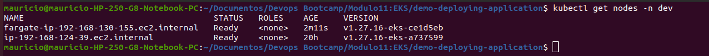

  In the figure above, it can be seen that a node of type Fargate was generated.

- Clean Up Resources

  It is essential to destroy all resources used in this project to avoid unnecessary costs in the AWS account. First, the node group and Fargate profile were deleted, followed by the EKS cluster.

# Demo Project 3

Create EKS cluster with eksctl

## Technologies Used

Kubernetes, AWS EKS, Eksctl, Linux

## Project Description

- Create EKS cluster using eksctl tool that reduces the manual effort of creating an EKS cluster

### Details of project  

  In this project, a Kubernetes cluster was created using eksctl, which offers the advantage of creating a cluster with just one command, without the need to manually set up IAM roles or a VPC. This also simplifies the process when setting up multiple environments.

- Installing eksctl

  eksctl was installed on my Ubuntu system using the following commands:

  ```
    sudo apt update
    curl -s --location "https://github.com/weaveworks/eksctl/releases/latest/download/eksctl_$(uname -s)_amd64.tar.gz" | tar xz -C /tmp
    sudo mv /tmp/eksctl /usr/local/bin
    eksctl version
  ```

  After installation, AWS account credentials were configured to allow eksctl to create resources within the account. In the AWS module, an admin user was created and is already set up on my machine.

- Creating the EKS Cluster

  It is possible to create a cluster by simply running the eksctl create cluster command, which will set up a cluster with default configurations. However, here it was customized some options, such as the name, version, region, instance type, and more:

  ```
    eksctl create cluster --name demo-cluster --version 1.27 --region us-east-1 --nodegroup-name demo-nodes --node-type t2.micro --nodes 2 --nodes-min 1 --nodes-max 3
  ```

  It’s also possible to specify all configurations in a YAML file, which eksctl can read to create the cluster. This approach is helpful for setups that require many configuration options.

  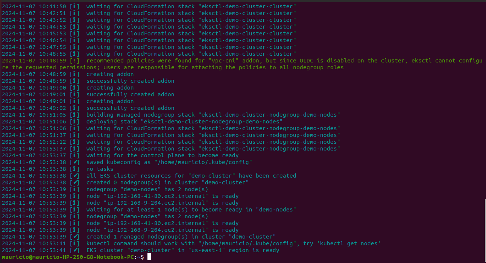

  The resources created can be verified in the AWS console, which includes:

  Two IAM roles:

  eksctl-demo-cluster-cluster-ServiceRole-iIRcgAMqJprx (cluster roles)
  eksctl-demo-cluster-nodegroup-demo-NodeInstanceRole-t3YkYQ75nzhZ (node group roles)
  
  VPC: eksctl-demo-cluster-cluster/VPC
  
  EC2: Two instances were created as configured for 2 worker nodes.

  EKS: The EKS cluster with the worker nodes

  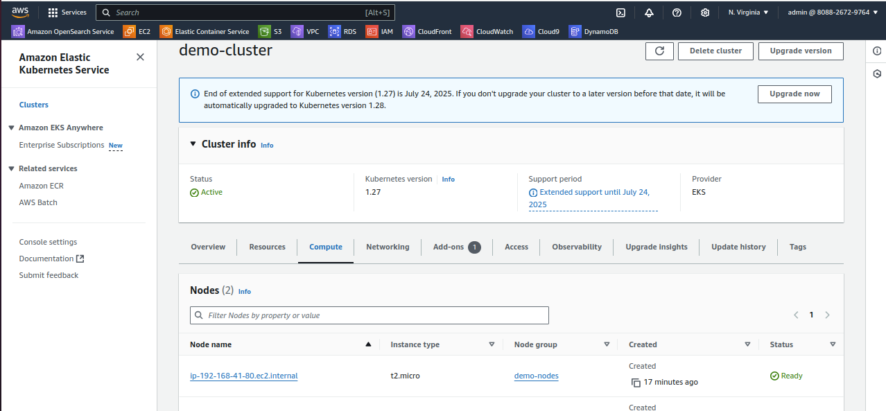

# Demo Project 4

Create EKS cluster with eksctl

## Technologies Used

Kubernetes, AWS EKS, Eksctl, Linux

## Project Description

- Create EKS cluster using eksctl tool that reduces the manual effort of creating an EKS cluster

### Details of project   

- Install kubectl on the Jenkins Server

  The first step is to log into the cloud server instance where Jenkins is running and enter the container that is running Jenkins. The commands used to install kubectl are as follows:

  ```
    apt update
    curl -LO "https://dl.k8s.io/release/$(curl -L -s https://dl.k8s.io/release/stable.txt)/bin/linux/amd64/kubectl"
    chmod +x kubectl
    mv kubectl /usr/local/bin/
  ```

- Install AWS IAM Authenticator

  This installation is specific to the use of AWS EKS.

  ```
    curl -Lo aws-iam-authenticator https://github.com/kubernetes-sigs/aws-iam-authenticator/releases/download/v0.6.11/aws-iam-authenticator_0.6.11_linux_amd64
    chmod +x ./aws-iam-authenticator
    mv ./aws-iam-authenticator /usr/local/bin
  ```

- Create kubeconfig File for Jenkins

  This file was created manually outside the container, as the container does not have the necessary tools. The file content is in config.yaml and was adjusted with the values for cluster name, endpoint, and certificate authority. It was then transferred to the default config location inside the container.

  A .kube directory was created inside the container, and the config file was copied using the following command:

  ```
  docker cp config <image id>:/var/jenkins_home/.kube/
  ```

- Create AWS Credentials

  As a best practice, you can create an AWS IAM User specifically for Jenkins; however, in this case, the admin user for Jenkins will be used.

  For this project, a branch named deploy-on-k8s was added to the java-maven-app pipeline repository. In this pipeline, new credentials of type Secret text were created using the AWS credentials configured on the local machine.

- Configure Jenkinsfile to Deploy to EKS

  Within the deploy stage, it is possible to run kubectl commands in the pipeline to create a deployment. The AWS credentials added to the pipeline were also used as environment variables.

  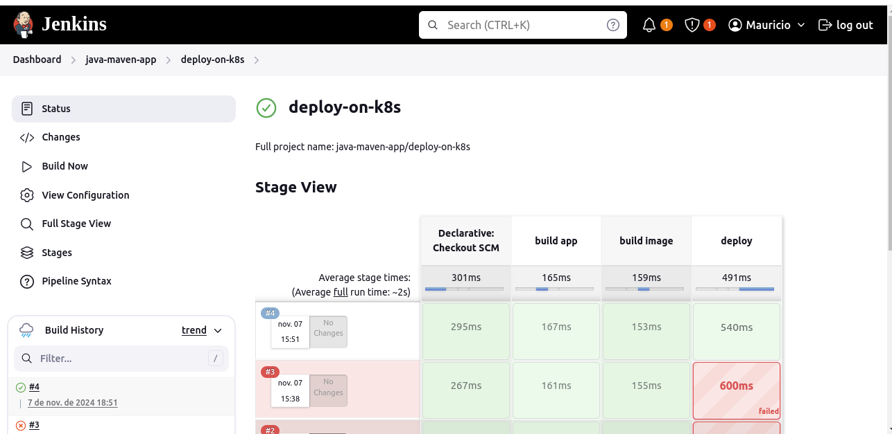

  In the figure above, you can see that the pipeline successfully ran kubectl, and viewing the pipeline logs shows the command execution.

  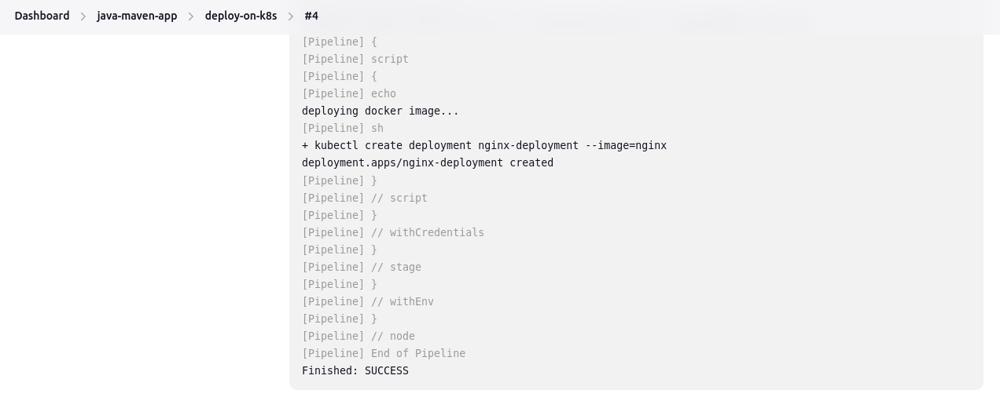

# Demo Project 5

CD - Deploy to EKS cluster from Jenkins Pipeline

## Technologies Used

Kubernetes, Jenkins, AWS EKS, Docker, Linux

## Project Description

- Install kubectl and aws-iam-authenticator on a Jenkins server
- Create kubeconfig file to connect to EKS cluster and add it on Jenkins server
- Add AWS credentials on Jenkins for AWS account authentication
- Extend and adjust Jenkinsfile of the previous CI/CD pipeline to configure connection to EKS cluster

### Details of project   

- Install kubectl on Jenkins Server

  The first step is to log in to the cloud server instance running Jenkins and access the container running Jenkins. The commands used to install kubectl are listed below:

  ```
    apt update

    curl -LO "https://dl.k8s.io/release/$(curl -L -s https://dl.k8s.io/release/stable.txt)/bin/linux/amd64/kubectl"

    chmod +x kubectl

    mv kubectl /usr/local/bin/
  ```

- Install AWS IAM Authenticator

  This installation is specific to using AWS EKS.

  ```
    curl -Lo aws-iam-authenticator https://github.com/kubernetes-sigs/aws-iam-authenticator/releases/download/v0.6.11/aws-iam-authenticator_0.6.11_linux_amd64

    chmod +x ./aws-iam-authenticator

    mv ./aws-iam-authenticator /usr/local/bin
  ```

- Create kubeconfig File for Jenkins

  This file was manually created outside the container since it lacks the necessary tools. The content of this file is in config.yaml. It was adjusted with the cluster name, endpoint, and certificate authority values. Then, it was transferred to the default configuration location inside the container.

  A .kube directory was created inside the container, and the config file was copied using the following command:

  ```
    docker cp config 73496da0a944:/var/jenkins_home/.kube/
  ```

- Create AWS Credentials
  
  As a best practice, it is possible to create an AWS IAM User for Jenkins. However, in this case, the Jenkins admin user will be used.

  For this project, a branch named deploy-on-k8s was added to the java-maven-app pipeline repository. Within this pipeline, new credentials of type Secret text were created using the AWS credentials configured on the local machine.

- Configure Jenkinsfile to Deploy to EKS

  Within the deploy stage, it is possible to run kubectl commands in the pipeline to create a deployment. Additionally, the credentials added to the pipeline were used as environment variables.

  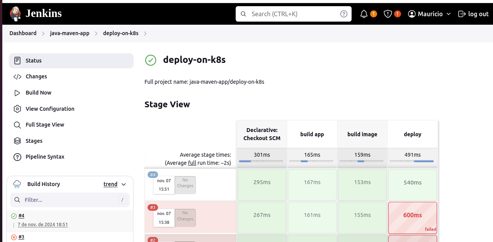

  The figure above shows that the pipeline successfully executed the kubectl command. By checking the pipeline logs, it is possible to see the command execution.

  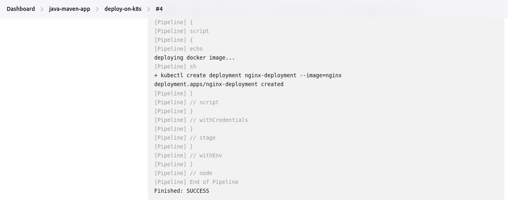

# Demo Project 6

Complete CI/CD Pipeline with EKS and private DockerHub registry

## Technologies Used

Kubernetes, Jenkins, AWS EKS, Docker Hub, Java, Maven, Linux, Docker,Git

## Project Description

- Write K8s manifest files for Deployment and Service configuration
- Integrate deploy step in the CI/CD pipeline to deploy newly built application image from DockerHub private registry to the EKS cluster
- So the complete CI/CD project we build has the following configuration:
    a. CI step: Increment version
    b. CI step: Build artifact for Java Maven application
    c. CI step: Build and push Docker image to DockerHub
    d. CD step: Deploy new application version to EKS cluster
    e. CD step: Commit the version update

### Details of project  

- Using the java-maven-app repository

  For this project, the java-maven-app repository is used, specifically the jenkins-version branch (https://github.com/Mauricio-Camilo/java-maven-app/tree/jenkins-version). The Jenkinsfile in this branch contains the entire code internally and includes image versioning.

1. Create Deployment and Service & Adjust Jenkinsfile

- Deployment and Service Files

  Minimal configuration files (deployment.yaml and service.yaml) were created to deploy the application. Each time the pipeline runs, a new image is generated. As such, the deployment versioning must be dynamic. To optimize the code, environment variables are set in the Jenkinsfile.

- Using envsubst

  The envsubst tool substitutes placeholders in the YAML files with environment variable values. The tool processes the input file, replacing any occurrences of $ with corresponding environment variable values in the Jenkinsfile. It generates a temporary file, which is then passed as a parameter to the kubectl command:

  ```
    sh 'envsubst < kubernetes/deployment.yaml | kubectl apply -f -'
    sh 'envsubst < kubernetes/service.yaml | kubectl apply -f -'
  ```

- Installing gettext-base Tool on Jenkins
  
  The envsubst tool requires gettext-base to be installed on the Jenkins server. This was done by SSH-ing into the Jenkins instance, entering the container using docker exec, and running the following command:

  ```
    apt-get install gettext-base
  ```

2. Create Secret for DockerHub Credentials

   To allow Kubernetes to fetch the new image from the private repository during pipeline execution, authentication must be handled within the cluster. The credentials from the build image 
   stage are reused in the deploy stage via a Kubernetes secret.

- Best Practices for Secrets

  Secrets should be stored securely in a repository and limited to one per namespace. In this project, the secret was created using the following command:

  ```
    kubectl create secret docker-registry my-registry-key --docker-server=docker.io --docker-username=mauriciocamilo --docker-password=password
  ```

- Configuring Deployment to Use the Secret

  The pod section in the deployment file was updated to include the secret:

  ```
    imagePullSecrets:
      - name: my-registry-key
  ```

3. Running the Jenkins Pipeline

   After pushing changes to the repository, the pipeline executed successfully.

   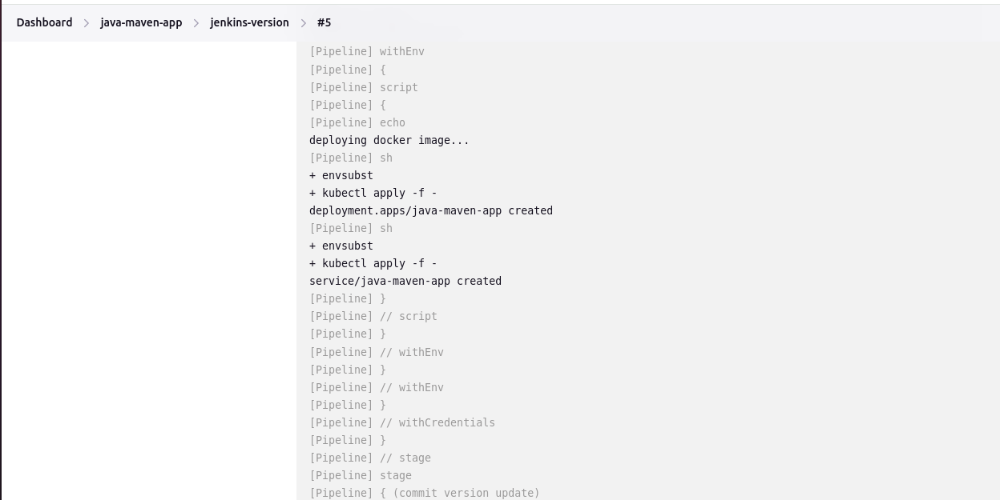

   Logs confirm the kubectl commands were executed without errors.

- AWS ECR Integration

  1. Create an ECR Repository

  A private repository named java-maven-app was created in AWS ECR with default configurations. ECR provides push commands for login and image upload.

  2. Create Credentials in Jenkins

  Using the login command from ECR:

  ```
    aws ecr get-login-password --region us-east-1
  ```

   The password is extracted, and the username (AWS) is used for authentication. These credentials were added to Jenkins, along with the repository URL provided by AWS.

  3. Create Secret for AWS ECR

  The Kubernetes secret for ECR credentials was created using the following command:

  ```
    kubectl create secret docker-registry aws-registry-key \
      --docker-server=808826729764.dkr.ecr.us-east-1.amazonaws.com \
      --docker-username=AWS \
      --docker-password=YOUR_ECR_PASSWORD
  ```

  This secret was then used in the deployment file to connect to the ECR repository.

  4. Update Jenkinsfile

  The Jenkinsfile was updated to:

    - Replace the credentialsId with ecr-credentials.
    - Update the repository URL in the build stage.

  5. Run Pipeline

  After committing changes, the pipeline ran successfully.

  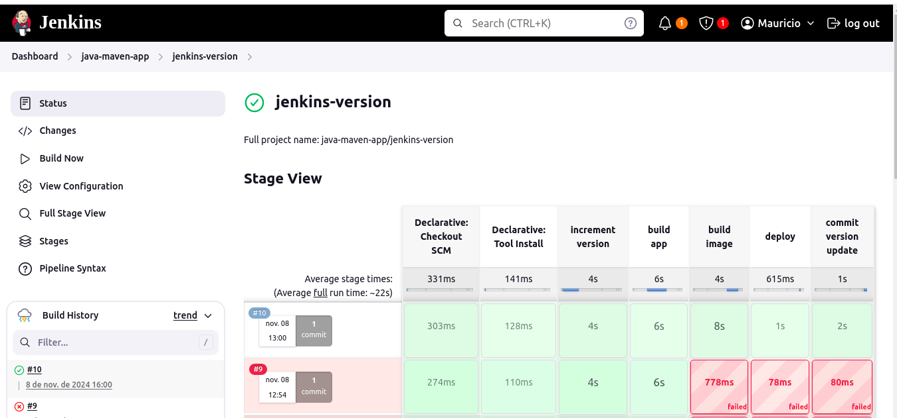

  The logs confirm the image was successfully pushed to ECR.

  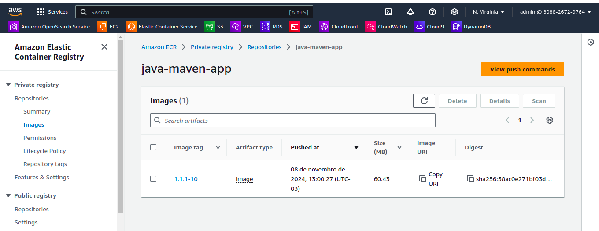
